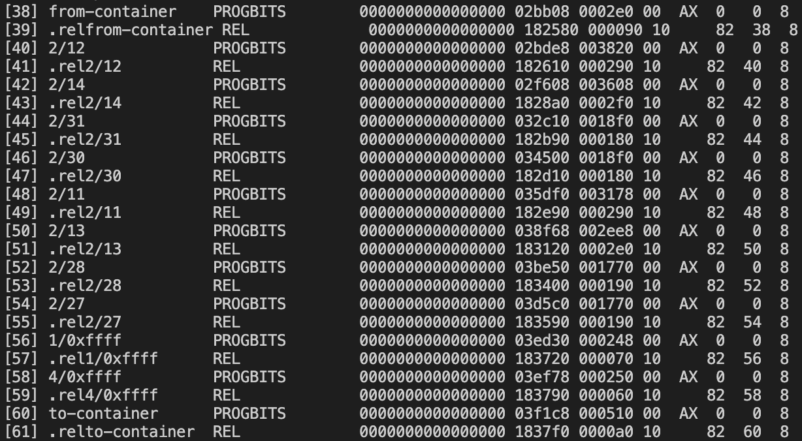

# Learning

## BPF ELF Loader
BPF ELF Loader에 다양한 종류가 있는것을 확인 할 수 있었음.
* iproute2
* libbpf
* perf

위 3개 뿐만 아니라 다양한 `BPF ELF Loader`가 존재하는것을 확인 함.\
`Cilium`이 개발되던 초창기의 경우 `maps in maps`, `pinning`, `bpf2bpf function call`를 지원하는 라이브러리는 `iproute2`가 유일했음.\
라이브러리 마다 `bpf_map`을 구현하는 방법이 다르다 보니 호환성 문제가 대두되기 시작함.\ 
이후 `libbpf`가 거의 표준으로 자리 잡게 됨.
2023년 기준 리눅스의 다양한 프로젝트들과의 호환성을 위해 `libbpf`로 변경 작업을 진행하는 것을 알 수 있음.

### libbpf
eBPF를 처음 학습하면서 사용했던 라이브러리고 현재 eBPF의 표준으로 자리잡고 있다는것을 확인함.\
이번 해당 이슈를 해결하기전까지는 `libbpf`에서 강요하는 `ELF Section Name`에 대해 잘 이해하지 못했었음.\
이번 이슈를 통해 간략하지만 `BPF ELF Loader`를 학습하면서 내가 작성한 `eBPF Program`의 `ELF Section`이 어떻게 사용되는지 이해함.\
[libbpf-program_types](https://docs.kernel.org/bpf/libbpf/program_types.html)을 보면 각각 프로그램 타입에 따라 `ELF Section Name`을 강요하는 것을 볼 수 있음.

아래 두 사진은 `bpf_lxc`와 관련된 `elf section header`의 부분임.
* 수정 전
	
	수정 전의 경우 [38],[39]의 `from-container`와 [60],[61]의 `to-container`를 볼 수 있음.
* 수정 후
	
	수정 후의 경우 [38], [39]의 `tc`를 볼 수 있음.

수정 전 두 `ELF Section`의 크기와 수정 후의 `ELF Section`의 크기가 같은 것을 알 수 있음.\
이렇게 `tc`로 변경된 두 프로그램은 `libbpf`를 통해 커널에 적재 가능.

### iproute2
eBPF의 map과 관련된 기능 `maps in maps`, `pinning`, `bpf2bpf function call` 3가지를 가장 먼저 지원.\
초기 네트워크와 관련된 eBPF 프로그램들은 iproute2에서 제공하는 기능들로 구성됨.\
특히 [bpf_elf_map](https://github.com/eworm-de/iproute2/blob/19f44c06e5e276a35758bb154fa4eaddf9f3b5b2/include/bpf_elf.h#L32) 특이한 맵 구조를 사용하는것을 확인 함.
