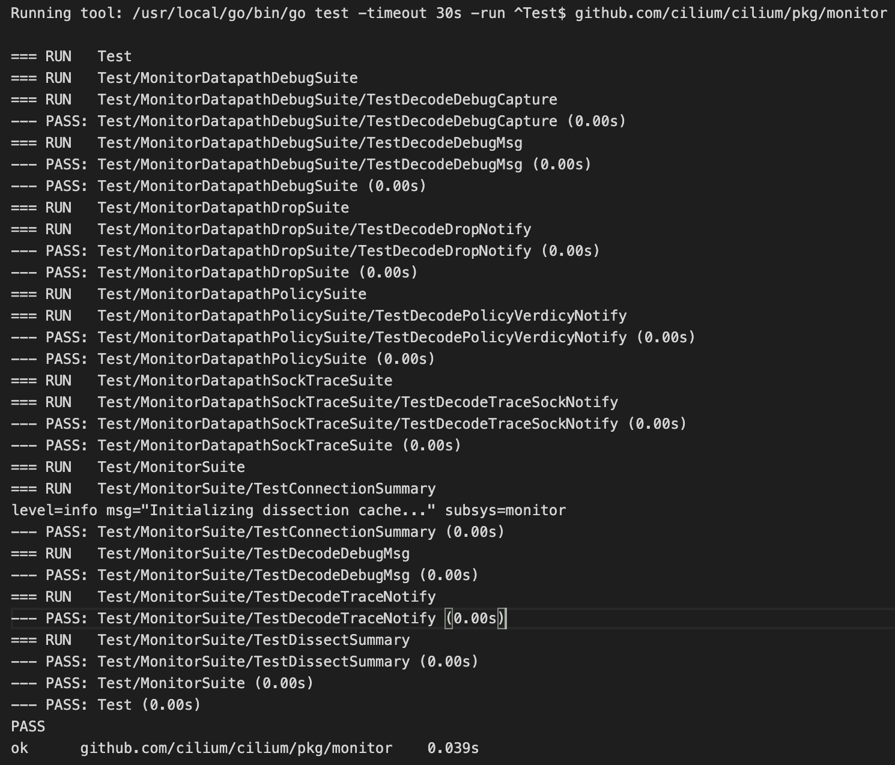
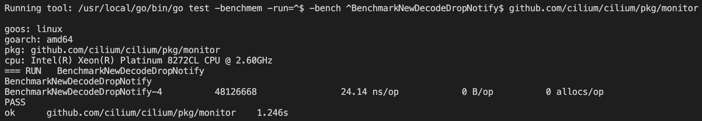

# Learning

## cilium test code
메인테이너의 [리뷰](https://github.com/cilium/cilium/pull/25751#pullrequestreview-1462682957)를 보면 제출한 PR의 함수 일부분이 비정상 작동하는것을 알 수 있음.\
[CI-Result](https://app.travis-ci.com/github/cilium/cilium/builds/263540119#L21387) 해당 내용을 확인 해보면 21387 Log에서 `TestDecodeDebugEvent`가 실패하고 있는것을 확인 함.\
테스트 코드의 위치는 `pkg/hubble/parser/debug/parser_test.go`
* **TestDecodeDebugEvent**
	```go
	func TestDecodeDebugEvent(t *testing.T) {
		endpointGetter := &testutils.FakeEndpointGetter{
			OnGetEndpointInfoByID: func(id uint16) (endpoint v1.EndpointInfo, ok bool) {
				if id == 1234 {
					return &testutils.FakeEndpointInfo{
						ID:           1234,
						Identity:     5678,
						PodName:      "somepod",
						PodNamespace: "default",
					}, true
				}
				return nil, false
			},
		}

		p, err := New(log, endpointGetter)
		assert.NoError(t, err)

		tt := []struct {
			name    string
			data    []byte
			cpu     int
			ev      *flowpb.DebugEvent
			wantErr bool
		}{
			{
				name: "Generic event",
				data: encodeDebugEvent(&monitor.DebugMsg{
					Type:    monitorAPI.MessageTypeDebug,
					SubType: monitor.DbgGeneric,
					Source:  0,
					Arg1:    1,
					Arg2:    2,
				}),
				cpu: 0,
				ev: &flowpb.DebugEvent{
					Type:    flowpb.DebugEventType_DBG_GENERIC,
					Hash:    wrapperspb.UInt32(0),
					Arg1:    wrapperspb.UInt32(1),
					Arg2:    wrapperspb.UInt32(2),
					Arg3:    wrapperspb.UInt32(0),
					Message: "No message, arg1=1 (0x1) arg2=2 (0x2)",
					Cpu:     wrapperspb.Int32(0),
				},
			},
			{
				name: "IPv4 Mapping",
				data: encodeDebugEvent(&monitor.DebugMsg{
					Type:    monitorAPI.MessageTypeDebug,
					SubType: monitor.DbgIPIDMapSucceed4,
					Source:  1234,
					Hash:    705182630,
					Arg1:    3909094154,
					Arg2:    2,
				}),
				cpu: 2,
				ev: &flowpb.DebugEvent{
					Type: flowpb.DebugEventType_DBG_IP_ID_MAP_SUCCEED4,
					Source: &flowpb.Endpoint{
						ID:        1234,
						Identity:  5678,
						PodName:   "somepod",
						Namespace: "default",
					},
					Hash:    wrapperspb.UInt32(705182630),
					Arg1:    wrapperspb.UInt32(3909094154),
					Arg2:    wrapperspb.UInt32(2),
					Arg3:    wrapperspb.UInt32(0),
					Message: "Successfully mapped addr=10.11.0.233 to identity=2",
					Cpu:     wrapperspb.Int32(2),
				},
			},
			{
				name: "ICMP6 Handle",
				data: encodeDebugEvent(&monitor.DebugMsg{
					Type:    monitorAPI.MessageTypeDebug,
					SubType: monitor.DbgIcmp6Handle,
					Source:  1234,
					Hash:    0x9dd55684,
					Arg1:    129,
				}),
				cpu: 3,
				ev: &flowpb.DebugEvent{
					Type: flowpb.DebugEventType_DBG_ICMP6_HANDLE,
					Source: &flowpb.Endpoint{
						ID:        1234,
						Identity:  5678,
						PodName:   "somepod",
						Namespace: "default",
					},
					Hash:    wrapperspb.UInt32(0x9dd55684),
					Arg1:    wrapperspb.UInt32(129),
					Arg2:    wrapperspb.UInt32(0),
					Arg3:    wrapperspb.UInt32(0),
					Message: "Handling ICMPv6 type=129",
					Cpu:     wrapperspb.Int32(3),
				},
			},
			{
				name: "Unknown event",
				data: encodeDebugEvent(&monitor.DebugMsg{
					Type:    monitorAPI.MessageTypeDebug,
					SubType: monitor.DbgUnspec,
					Source:  10000,
					Hash:    0x12345678,
					Arg1:    10,
					Arg2:    20,
					Arg3:    30,
				}),
				cpu: 1,
				ev: &flowpb.DebugEvent{
					Type: flowpb.DebugEventType_DBG_EVENT_UNKNOWN,
					Source: &flowpb.Endpoint{
						ID: 10000,
					},
					Hash:    wrapperspb.UInt32(0x12345678),
					Arg1:    wrapperspb.UInt32(10),
					Arg2:    wrapperspb.UInt32(20),
					Arg3:    wrapperspb.UInt32(30),
					Message: "Unknown message type=0 arg1=10 arg2=20",
					Cpu:     wrapperspb.Int32(1),
				},
			},
			{
				name:    "No data",
				data:    nil,
				wantErr: true,
			},
			{
				name:    "Invalid data",
				data:    []byte{0, 1, 2},
				wantErr: true,
			},
		}

		for _, tc := range tt {
			t.Run(tc.name, func(t *testing.T) {
				ev, err := p.Decode(tc.data, tc.cpu)
				if tc.wantErr {
					assert.NotNil(t, err)
				} else {
					assert.NoError(t, err)
					assert.Equal(t, tc.ev, ev)
				}
			})
		}
	}
	```
실제로 내가 코드를 구현한 위치인 `pkg/monitor/`가 아닌곳에서 전체적인 `Decode`로직을 테스트하고 있는게 신기했음.\
다만 메인테이너의 요청으로 `pkg/monitor/datapath_xxx_test.go`에 별도의 유닛테스트를 추가함.\
`cilium`은 특이하게 `suite`을 이용해 처리하고 있음.\
`pkg/monitor` 테스트의 진입점은 `dissect_test.go`에 존재하고 있음.
* **pkg/monitor/dissect_test.go**
	```go
	// Hook up gocheck into the "go test" runner.
	func Test(t *testing.T) {
		TestingT(t)
	}

	type MonitorSuite struct{}

	var _ = Suite(&MonitorSuite{})
	```
* **github.com/cilium/checkmate/run.go**
	```go
	// -----------------------------------------------------------------------
	// Test suite registry.

	var allSuites []interface{}

	// Suite registers the given value as a test suite to be run. Any methods
	// starting with the Test prefix in the given value will be considered as
	// a test method.
	func Suite(suite interface{}) interface{} {
		allSuites = append(allSuites, suite)
		return suite
	}
	```
	해당 패키지에 구현된 Suite함수를 통해 전역 변수에 추가하는 것을 알 수 있음.

* **pkg/monitor/datapath_drop_test.go**
	```go
	type MonitorDatapathDropSuite struct{}

	var _ = Suite(&MonitorDatapathDropSuite{})

	func (s *MonitorDatapathDropSuite) TestDecodeDropNotify(c *C) {
		// This check on the struct length constant is there to ensure that this
		// test is updated when the struct changes.
		c.Assert(DropNotifyLen, Equals, 36)

		input := DropNotify{
			Type:     0x00,
			SubType:  0x01,
			Source:   0x02_03,
			Hash:     0x04_05_06_07,
			OrigLen:  0x08_09_0a_0b,
			CapLen:   0x0c_0d_0e_10,
			SrcLabel: 0x11_12_13_14,
			DstLabel: 0x15_16_17_18,
			DstID:    0x19_1a_1b_1c,
			Line:     0x1d_1e,
			File:     0x20,
			ExtError: 0x21,
			Ifindex:  0x22_23_24_25,
		}
		buf := bytes.NewBuffer(nil)
		err := binary.Write(buf, byteorder.Native, input)
		c.Assert(err, IsNil)

		output := &DropNotify{}
		err = DecodeDropNotify(buf.Bytes(), output)
		c.Assert(err, IsNil)

		c.Assert(output.Type, Equals, input.Type)
		c.Assert(output.SubType, Equals, input.SubType)
		c.Assert(output.Source, Equals, input.Source)
		c.Assert(output.Hash, Equals, input.Hash)
		c.Assert(output.OrigLen, Equals, input.OrigLen)
		c.Assert(output.CapLen, Equals, input.CapLen)
		c.Assert(output.SrcLabel, Equals, input.SrcLabel)
		c.Assert(output.DstLabel, Equals, input.DstLabel)
		c.Assert(output.DstID, Equals, input.DstID)
		c.Assert(output.Line, Equals, input.Line)
		c.Assert(output.File, Equals, input.File)
		c.Assert(output.ExtError, Equals, input.ExtError)
		c.Assert(output.Ifindex, Equals, input.Ifindex)
	}
	```
나머지 부분도 위와 유사하게 테스트를 작성함.\
테스트를 진행하면 아래와 같은 결과를 얻을 수 있음.


## golang benchmark
### basic
golang은 자체적으로 벤치마크 기능을 제공 하고 있음.\
벤치마크 테스트를 진행하기 위해서 테스트 함수를 작성하는 경우 함수 이름을 `Benchmark(*testing.B)` 형태로 작성해야 함.\
벤치마크 함수의 전체적 구조는 아래와 같음.
```go
BenchmarkXXX(b *testing.B) {
	for i := 0; i< b.N; i++ {
		...
	}
}
```

`testing.B`의 구조체를 확인 해보면
```go
type B struct {
	N int
	// contains filtered or unexported fields
}
```
위와 같이 `N`만 public으로 접근 가능 한 것을 확인 할 수 있음.\
해당 `N`은 반복을 통해 벤치마크 테스트가 신뢰를 가질 수 있는 적당한 숫자로 설정됨.

### how to read benchmark results

|TestName-NumOfCores  | Iterations | ns/op | B/op | allocs/op |
|-------------------|-----------|-----------|-------------|--------------|
|BenchMarkNewDecodeDropNotify-4| 48126668 | 24.14 ns/op| 0 B/op | 0 allocs/op |

* Number of cores
  * 테스트에서 사용하는 CPU 갯수
  * 위 예시는 4개
* Iterations(The number of iterations)
  * 이 숫자는 통계를 얻기 위해 for 루프가 실행된 횟수.
  * 벤치마크 기간을 늘리기 위해 -benchtime 플래그를 사용하여 반복 횟수를 늘릴 수 있음.
  * 벤치마크에서 실행된 총 반복 횟수가 아님.
* ns/op(Nanoseconds per operation)
  * 함수가 평군적으로 얼마나 빠르게 실행되는지 알 수 있음.
  * 위 예시에서는 `DecodeDropNotify`를 한번 실행하는데 평균 `24.14ns`가 걸림.
* B/op(Number of bytes allocated per operation)
  * benchmark 실행 시 `-test.benchmem`일 사용하거나 코드에서 `ReportAllocs`를 사용하면 확인 가능.
  * 함수의 메모리 사용량을 추적 할 수 있음.
* allos/op(Number of allocations per operation)
  * 실행당 평균 메모리 할당 횟수.
